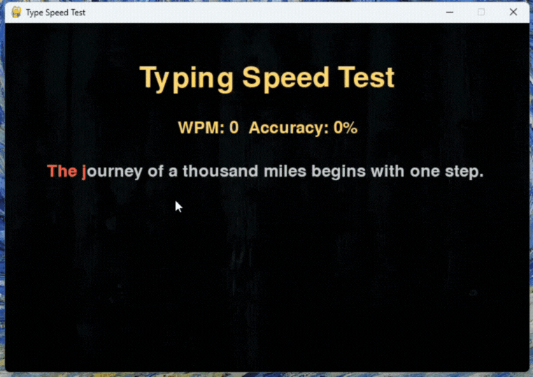

# Python-Typing-Speed-Game

A fun and interactive typing speed test game built with Python and Pygame. Test your typing skills, improve accuracy, and track your progress with real-time WPM and accuracy display.

## Features

* Real-time WPM calculation similar to Monkeytype.
* Accuracy tracking for each typing session.
* Long and short sentences for varied practice.
* Stores best WPM and accuracy locally in `stats.json`.
* Reset game and replayable sessions.
* Visual feedback: correct letters in green, mistakes in red.
* Cursor indicator for better typing experience.

## Installation

1. Clone the repository:

```bash
git clone https://github.com/pathipat11/Python-Typing-Speed-Game.git
```

2. Navigate to the project directory:

```bash
cd Python-Typing-Speed-Game
```

3. Install required packages:

```bash
pip install pygame
```

## Usage

1. Place `sentences.txt`, `background.jpg`, and `type-speed-open.png` in the project folder.
2. Run the game:

```bash
python main.py
```

3. Start typing the displayed sentence.
4. Press `Enter` to finish and see your results.
5. Press `Escape` or click `Reset` to try a new sentence.

## 🎬 Demo Video




## Contributing

Contributions are welcome! Feel free to submit a pull request or open an issue.

## Author

**Pathipat Mattra**

* 🌐 Facebook: [Pathipat Mattra](https://facebook.com/pathipat.mattra)
* 💻 GitHub: [pathipat11](https://github.com/pathipat11)
* 💼 LinkedIn: [Pathipat Mattra](https://linkedin.com/in/viixl)
